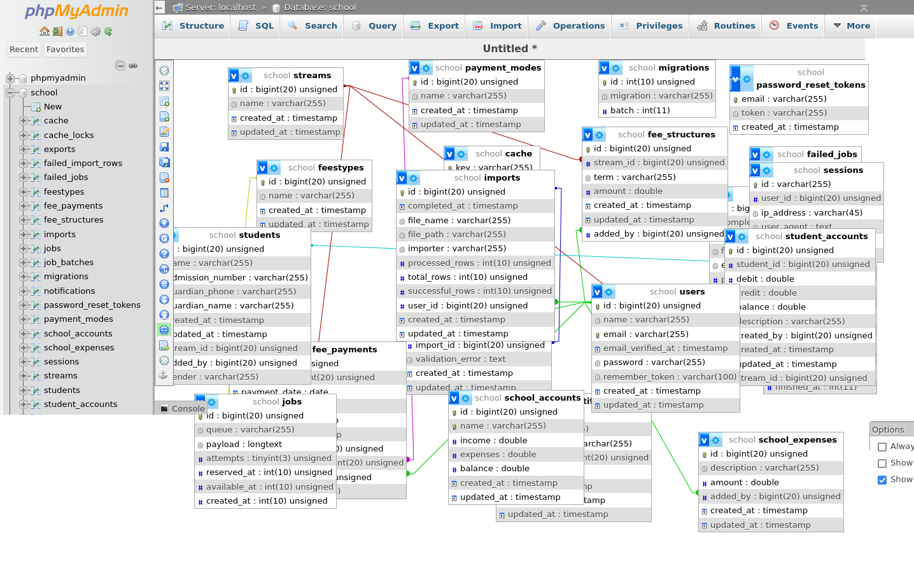
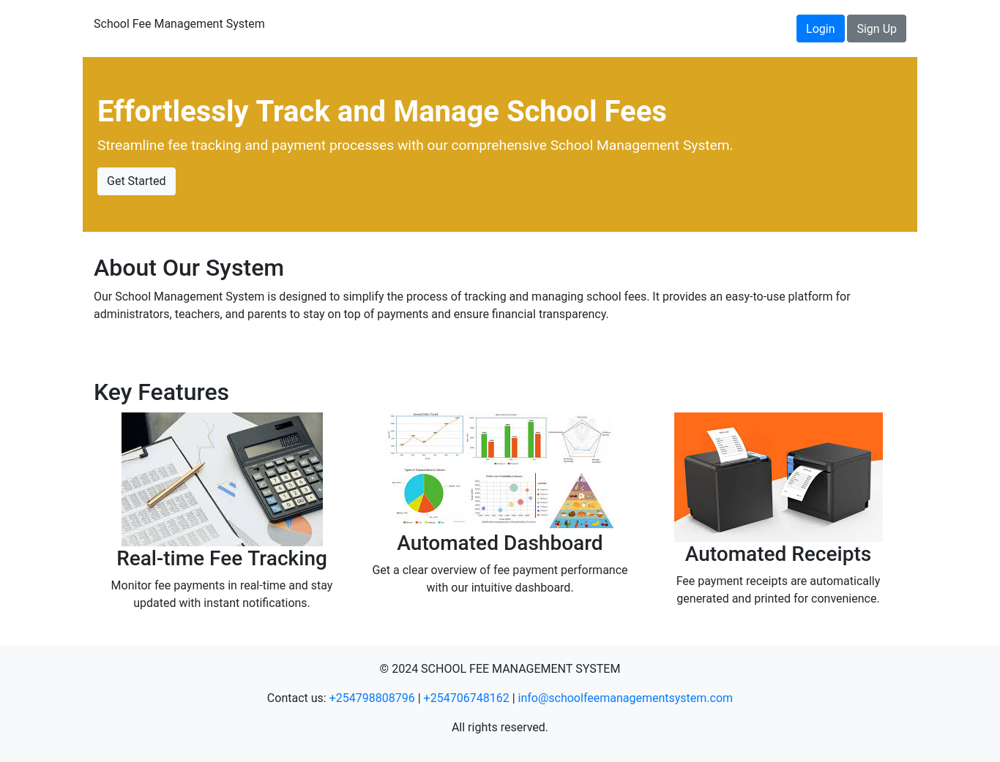

# School Fees Management System (SFMS)

## Background
Among the most challenging tasks in managing academy schools in Kenya is the task of accounting. Especially in school fees collections and managing accounting for expenses. With the change of our academic system and growing changes in technology, there is need to develop systems that are friendly, easy to use, and adaptable for future technological changes. 

Our SFMS was built to solve this issue.

## System Outline

Our approach to solve this issue was through creating a finance account for all admitted students, and billing the students based on the fee structure that is given.

We also created a different pooling account for the entire school where all transactions that include debiting of account and all expenses can be accounted for. 

These two statements are the summary of our entire system.

# Hardware Requirements
Any computer setup able to run the software specifications below. 

# Software Requirements
- PHP v8.x^
- Laravel 11.x^
- Mysql - (or an alternative DBMS)

# Database Structure.

*The structure of the database is as shown above.*

# Gallery of the system overview
## Landing Page

*Current Landing Page Image*